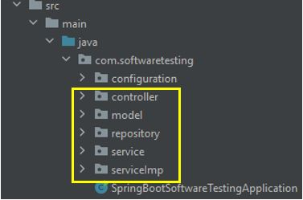
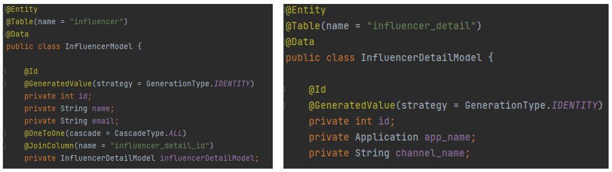

# unit-integration-testing
## Introduction
When delving into Spring Boot testing, I initially found it confusing due to the abundance of terms and frameworks associated with it, such as JUnit, Mockito, Spring Boot Test, MockMvc, TestNG, RestTemplate, and more. Each of these frameworks serves a specific purpose in simplifying the process of writing tests in Spring Boot.

However, before deciding which framework to utilize for writing tests, it's essential to take a step back and start with the fundamental concept of "Types of Testing." Understanding the different types of software testing will help us determine which specific framework is best suited for each type of testing scenario in the Spring Boot.

In regard to this, I'll share some methods for testing as well as a few frameworks that perform well with Spring Boot Test.

## Types of Testing
We can divide the type of testing into two majority groups as follows:
1. Functional testing typically involves testing individual functions, modules, or components of the software to check if they behave as expected.
2. Non-functional testing is focused on evaluating aspects of the software application that are not directly related to its specific functions or features. Instead, it aims to assess the software's quality attributes and characteristics that contribute to its overall performance, usability, and reliability.

I'd like to advise looking at the illustration below for more details.

## Unit Testing and Integration Testing
In the illustration you're going to see, there are many types of testing under both Functional Testing and Non-Functional Testing. But in this article, We're going to focus on Functional testing, including Unit Testing and Integration Testing.

Normally, Both Unit Testing and Integration Testing are performed by developers as part of the software development process.
And to write testing in both types, there are many frameworks that can make it easy. However, before I discuss that part, I would like to share a bit about the key difference between Unit Testing and Integration Testing.

**The overview comparison of Unit Testing and Integration Testing**
| Aspect                  | Unit Testing                                    | Integration Testing                              |
|------------------------|-------------------------------------------------|--------------------------------------------------|
| **Scope**              | Tests individual units or components in isolation | Verifies interactions between integrated units  |
| **Purpose**            | Ensure correctness of individual units          | Validate system behavior when units are combined|
| **Dependencies**       | Mocks or stubs external dependencies            | Requires actual integration with external systems|
| **Test Environment**   | Lightweight and can run in isolation             | May require a more complex test environment      |
| **Coverage**           | High code coverage, focused on individual units  | Covers interactions between integrated units    |
| **Automation**         | Often highly automated                           | Some tests may involve manual testing            |

## Testing in Spring Boot
In the provided illustration, you will notice the highlighted message emphasizing that Spring Boot strongly supports both Unit Testing and Integration Testing. When you create a new Spring Boot Project, it automatically includes the necessary testing dependencies, such as "**spring-boot-starter-test**" If you wish to perform testing with Spring Security, the "**spring-security-test**" dependency is also required.

Both of the dependencies that I mentioned are a set of libraries and utilities that Spring Boot prepares for you, making it easier to write unit tests and leading to more maintainable, efficient, and reliable tests, ultimately improving the overall quality of your application.

Hence, before delving into writing Unit Testing and Integration Testing, let me provide a brief overview of the libraries we will be using in this article.

**The overview of the libraries for Unit Testing and Integration Testing**
> Dependencies based on spring-boot-starter-test version 3.1.2

| Library   | Description                                                        |
|----------------|--------------------------------------------------------------------|
| JUnit 5.9.3    | JUnit is a widely-used testing framework for Java, simplifying unit test creation with annotations and assertions. |
| Mockito 5.3.1  | Mockito is a powerful mocking framework for Java, facilitating the creation of mock objects for isolating dependencies in tests. |
| MockMvc        | MockMvc is a component of Spring Test, enabling comprehensive testing of Spring MVC controllers and RESTful endpoints. |
| TestRestTemplate | TestRestTemplate is used for integration testing of RESTful APIs in Spring Boot, validating component interactions. |

## Architectural style and Testing

Prior to proceeding with writing the unit testing and integration testing, I'd like to provide a brief overview of the project structure and the class under consideration for testing. Kindly refer to the illustration presented below.

The architectural style is known as the "MVC" (Model-View-Controller) pattern, which may include a "Service" layer and a "Repository" layer as part of the Model component. The "MVCS" term is not commonly used or established in the software development community.

However, In this article, our primary focus will be on conducting testing for the Model, Service, and Controller components. Typically, the Repository is tested when there are specific query customizations or complex data access operations.

To facilitate comprehension, I will create a table below that illustrates the correlation between the MVC architectural style, the respective testing methods, and the libraries slated for utilization in this article.
| MVCS           | Types of Testing         | Library                    | Areas of Testing                                                                        |
|----------------|--------------------------|----------------------------|------------------------------------------------------------------------------------------|
| Model          | Unit Testing             | JUnit                      | Ensure correctness of model attributes, behaviors, and business logic.                  |
| Service        | Unit Testing             | Mockito                    | Test business logic and interactions within service methods.                             |
| Controller     | Integration Testing      | MockMvc                    | Simulate HTTP requests and validate controller behavior.                                 |
| Controller     | Integration Testing      | TestRestTemplate           | Test controller endpoints by sending actual HTTP requests.                                |

From the table provided above, you will observe that I conducted tests on the controller using both the MockMvc and TestRestTemplate libraries. While both of these tools fulfill the role of Integration testing. However, a significant distinction exists in terms of the testing concept and purpose.

**MockMvc** : This library creates a simulated applicationContext, which means it doesn't fully initialize all configurations or initiate the complete application. While MockMvc is advantageous for focused testing of individual controller endpoints, allowing precise examination of request and response handling, it might overlook potential issues that exclusively surface when the entire application is fully operational.

**TestRestTemplate** : In contrast, TestRestTemplate takes a more expansive approach by initializing the complete application. It starts the embedded server and loads all configurations akin to the normal startup procedure. This thorough testing environment is especially effective in revealing integration concerns and interactions among components that could escape detection when using MockMvc.

In conclusion, it's important to note that both MockMvc and TestRestTemplate possess their own respective strengths and weaknesses. The choice between the two hinges on your specific use case, testing objectives, and trade-offs. While MockMvc excels in pinpointing issues within individual endpoints, TestRestTemplate excels in exposing broader integration complexities. Ultimately, the decision of which tool to employ should be guided by the unique requirements and challenges of your application.

## Coding Time!! 
> **Testing Model by using Junit** 
Let's examine the provided Model example code below.

We can craft unit tests using JUnit. To generate a test for a class or method within IntelliJ IDEA, you can employ shortcuts. Simply press Ctrl+Shift+T. 

As for the testing code section, it should align with your preferred style or the specific attributes you wish to assess. Nonetheless, for the purposes of this illustration, I will concentrate solely on testing the 'getMethod' function.
