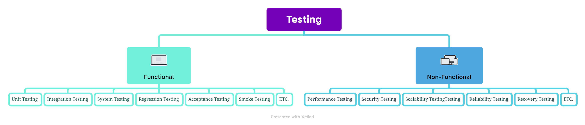

# unit-integration-testing
## Introduction
When delving into Spring Boot testing, I initially found it confusing due to the abundance of terms and frameworks associated with it, such as JUnit, Mockito, Spring Boot Test, MockMvc, TestNG, RestTemplate, and more. Each of these frameworks serves a specific purpose in simplifying the process of writing tests in Spring Boot.

However, before deciding which framework to utilize for writing tests, it's essential to take a step back and start with the fundamental concept of "Types of Testing." Understanding the different types of software testing will help us determine which specific framework is best suited for each type of testing scenario in the Spring Boot.

In regard to this, I'll share some methods for testing as well as a few frameworks that perform well with Spring Boot Test.

## Types of Testing
We can divide the type of testing into two majority groups as follows:
1. Functional testing typically involves testing individual functions, modules, or components of the software to check if they behave as expected.
2. Non-functional testing is focused on evaluating aspects of the software application that are not directly related to its specific functions or features. Instead, it aims to assess the software's quality attributes and characteristics that contribute to its overall performance, usability, and reliability.

I'd like to advise looking at the illustration below for more details.

## Unit Testing and Integration Testing
In the illustration you're going to see, there are many types of testing under both Functional Testing and Non-Functional Testing. But in this article, We're going to focus on Functional testing, including Unit Testing and Integration Testing.

Normally, Both Unit Testing and Integration Testing are performed by developers as part of the software development process.
And to write testing in both types, there are many frameworks that can make it easy. However, before I discuss that part, I would like to share a bit about the key difference between Unit Testing and Integration Testing.

`The overview comparison of Unit Testing and Integration Testing` 
| Aspect                  | Unit Testing                                    | Integration Testing                              |
|------------------------|-------------------------------------------------|--------------------------------------------------|
| **Scope**              | Tests individual units or components in isolation | Verifies interactions between integrated units  |
| **Purpose**            | Ensure correctness of individual units          | Validate system behavior when units are combined|
| **Dependencies**       | Mocks or stubs external dependencies            | Requires actual integration with external systems|
| **Test Environment**   | Lightweight and can run in isolation             | May require a more complex test environment      |
| **Coverage**           | High code coverage, focused on individual units  | Covers interactions between integrated units    |
| **Automation**         | Often highly automated                           | Some tests may involve manual testing            |

## Testing in Spring Boot
In the provided illustration, you will notice the highlighted message emphasizing that Spring Boot strongly supports both Unit Testing and Integration Testing. When you create a new Spring Boot Project, it automatically includes the necessary testing dependencies, such as `spring-boot-starter-test` If you wish to perform testing with Spring Security, the `spring-security-test` dependency is also required.

Both of the dependencies that I mentioned are a set of libraries and utilities that Spring Boot prepares for you, making it easier to write unit tests and leading to more maintainable, efficient, and reliable tests, ultimately improving the overall quality of your application.
